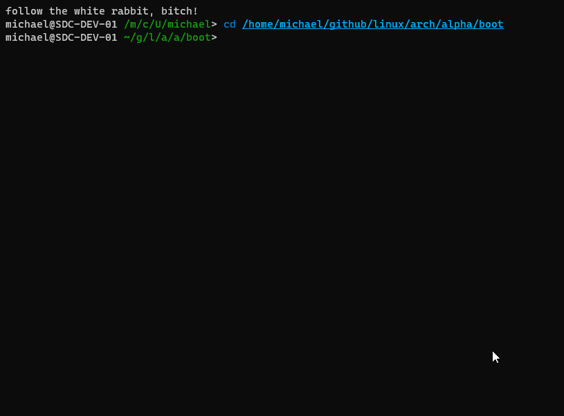

# vim-kernel

The one and only Vim/Neovim plugin for Linux kernel developers

# features

* Intuitive patch violation notification system
* Correctly sets editor configuration for kernel development
* Uses Linux kernel scripts to adhere to kernel.org/doc/html/v4.10/process/coding-style.html
* Cross Platform
	* Works with Vim & Neovim
	* Works with Linux, Windows & OSX
* Easy install into any plugin manager
	* Plug 'https://github.com/michaelrinderle/vim_kernel.git'

# requirements

* Vim/Neovim compiled with Python3
* Git
* Perl (For running kernel script, i.e. checkpatch.pl)

# roadmap

* UI Dev
    * Add optional buffer for full patch violation info
* Patch Management
    * Add pipeline checklist & operations for patch submission

# Demo

